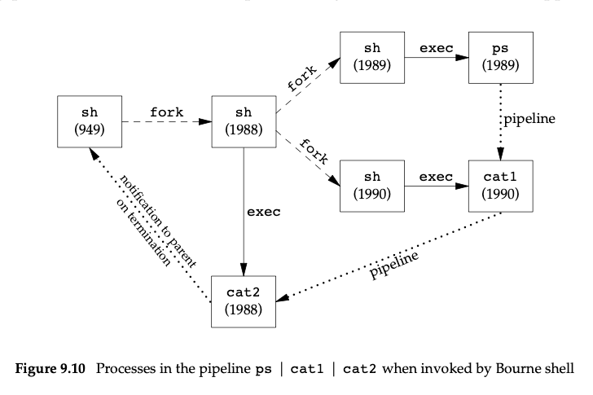

# Systemy operacyjne – Lista zadań nr 5

Należy przygotować się do zajęć czytając następujące rozdziały książek:

* Tanenbaum (wydanie czwarte): 4.1, 4.2, 10.6
* APUE (wydanie trzecie): 3.12, 3.15, 4.14 - 4.18, 15.2

## Zadanie 1

*Czym różnią się ścieżka absolutna, relatywna i znormalizowana? Względem którego katalogu obliczana jest ścieżka relatywna? Jakim wywołaniem systemowym zmienić ten katalog? Wyjaśnij czym są punkty montażowe, a następnie na podstawie `mount(8)` wyjaśnij znaczenie i zastosowanie następujących atrybutów punktów montażowych: «``noatime``», «``noexec``» i «``sync``».*

* Absolute path – względem root directory systemu (a może procesu? – sprawdzić)
* Relative path – względem Current Working Directory
  CWD można zmienić wywołaniem systemowym `chdir`
* Normalised path – absolutna bez `..` i `.`, symlinków?

Mount point is the location in VFS that the newly-mounted medium is registered; when the mounting process is completed, the user can access files and directories on the medium from there. A virtual file system (VFS) is an abstract layer on top of a more concrete file system. The purpose of a VFS is to allow client applications to access different types of concrete file systems in a uniform way.

``` man
noatime
     Do not update inode access times on this filesystem (e.g. for faster access on the news spool to speed  up news servers).  This works for all inode types (directories too), so it implies nodiratime.
```

``` man
noexec
       Do not permit direct execution of any binaries on the mounted filesystem.
```

``` man
sync
     All  I/O  to  the  filesystem should be done synchronously.  In the case of media with a limited number of write cycles (e.g. some flash drives), sync may cause life-cycle shortening.
```

As Wiktionary states, synchronous means the same time, at the same frequency.

## Zadanie 2

*Przywołując strukturę «`dirent`» i reprezentację katalogu z poprzednich ćwiczeń wyjaśnij krok po kroku jak działa rename(2). Zauważ, że korzystając z «`rename`» można również przenieść atomowo plik do innego katalogu pod warunkiem, że ten znajduje się w obrębie tego samego systemu plików. Czemu «`rename`» zakończy się błędem «`EXDEV`» kiedy próbujemy przenieść plik do innego systemu plików?*

Jak działa rename?

* usuwa docelowy wpis katalogu, jeśli taki istnieje
* tworzy docelowy wpis w katalogu
* usuwa stary wpis w katalogu

Jak widać, można zapewnić atomowość tej operacji. Jest tak dlatego, że przerwać jej wykonanie w każdej chwili, cofając skutki uboczne.
> The rename() system call causes the link named
     old to be renamed as new.  If new exists, it is
     first removed.  Both old and new must be of the
     same type (that is, both must be either directo-
     ries or non-directories) and must reside on the
     same file system.

struct dirent w Darwinie:

``` c
     struct dirent { /* when _DARWIN_FEATURE_64_BIT_INODE is NOT defined */
          ino_t      d_ino;          /* file number of entry */
          __uint16_t d_reclen;       /* length of this record */
          __uint8_t  d_type;         /* file type, see below */
          __uint8_t  d_namlen;       /* length of string in d_name */
          char    d_name[255 + 1];   /* name must be no longer than this */
     };
```

Żeby przenieść plik do innego systemu plików, trzeba skopiować jego zawartość, a nie zmienić wpisy w katalogach – `rename` nie wystarczy.

### // offtop

Jak zadziała `cp` między systemami plików w macOS?  
Uruchommy `strace`. Ha! Nie ma takiego numeru, zamiast tego mamy `dtruss`. Od macOS El Capitan System Integrity Protection nie pozwoli na uruchomienie `dtruss` na programie z `/bin/`. Skopiujmy program do katalogu bez restrykcji, `dtruss` wciąż nie zadziała na pliku podpisanym cyfrowo. Workaround: `codesign --remove-signature binary-name`. Który program uruchamia polecenie będące aliasem? `type -a command`. Sensowniejsze rozwiązanie: [Stack](https://stackoverflow.com/questions/33476432/is-there-a-workaround-for-dtrace-cannot-control-executables-signed-with-restri).

No to jak zadziała `cp`?

// Ciekawostka Dropsa: `ls -l` dodaje `*` do nazwy każdego pliku wykonywalnego.; opcja `-i` drukuje numery i-węzłów.

``` bash
a
```

## Zadanie 3

*Na podstawie slajdów do wykładu wyjaśnij różnice w sposobie implementacji dowiązań twardych (ang. hard link) i symbolicznych (ang. symbolic link). Jak za pomocą dowiązania symbolicznego stworzyć w systemie plików pętlę? Kiedy jądro systemu operacyjnego ją wykryje (błąd «`ELOOP`»)? Czemu pętli nie da się zrobić z użyciem dowiązania twardego? Skąd wynika liczba dowiązań do katalogów?*

* Dowiązania twarde – dowiązanie do i-węzła; zwykły wpis w katalogu, który odnosi się do określonego i-węzła (?)
* Dowiązanie symboliczne – dowiązanie do nazwy pliku; plik, który zawiera ścieżkę pliku, do którego jest dowiązanie  
  Nie da się stworzyć pętli używając dowiązania twardego, bo dowiązanie twarde kończy się na konkretnym pliku, który może być symlinkiem (ale nie hardlinkiem).

Jak stworzyć pętlę? Symlink może wskazywać na symlink.

``` bash
OSX : ~/test $ ln -s aaa bbb
OSX : ~/test $ ln -s bbb aaa
OSX : ~/test $ ls -al
total 0
drwxr-xr-x   4 madziej  staff   128B Nov 11 16:39 ./
drwx------@ 41 madziej  staff   1.3K Nov 11 16:37 ../
lrwxr-xr-x   1 madziej  staff     3B Nov 11 16:39 aaa@ -> bbb
lrwxr-xr-x   1 madziej  staff     3B Nov 11 16:39 bbb@ -> aaa
```

Symlink może też wskazywać na katalog. Totalny kociokwik.

Jądro nie wykrywa pętli, jedynie przekroczenie maksymalnego poziomu symlinków.
> [ELOOP] Too many symbolic links are encountered in translating the pathname. This is taken to be indicative of a looping symbolic link.

Liczba dowiązań do katalogu – liczba wszystkich wpisów katalogu łącznie z `.` oraz `..` w macOS, a w cywilizowanych uniksach `#subdirectories + 2`, z uwagą, że `ext` nie zlicza dowiązań katalogowi, jeśli liczba przekroczy 65K.
Liczbę dowiązań odczytasz używając `stat` z opcją `[-x]` (BSD), lub w drugiej kolumnie `ls -l`.

``` bash
Deb  ~/test  ls -al                       ✔  user@d3b14n
total 8
drwxr-xr-x  2 user user 4096 Nov 12 11:50 .
drwxr-xr-x 25 user user 4096 Nov 12 11:50 ..
-rw-r--r--  1 user user    0 Nov 12 11:15 nothing
-rw-r--r--  1 user user    0 Nov 12 11:15 thing
```

```bash
OSX  ~/test  ls -al                       ✔  madziej@MacBook-Air-Matej
total 0
drwxr-xr-x   4 madziej  staff   128B Nov 12 11:50 ./
drwx------@ 39 madziej  staff   1.2K Nov 12 11:34 ../
-rw-r--r--   1 madziej  staff     0B Nov 12 11:34 nothing
-rw-r--r--   1 madziej  staff     0B Nov 12 11:34 thing
```

Zinwestygujmy trochę nieoczekiwane zachowanie Darwina. W [Apple File System Reference](https://developer.apple.com/support/downloads/Apple-File-System-Reference.pdf) widzimy, że struktura `j_inode_val_t` przechowuje liczbę wpisów katalogu `nchildren` i liczbę twardych dowiązań `nlink` w unii. [Implementacja `stat`](https://opensource.apple.com/source/file_cmds/file_cmds-272.250.1/stat/stat.c.auto.html) tego nie uwzględnia.

## Zadanie 4 (P)

*Przeczytaj krytykę interfejsu plików przedstawioną w podrozdziale [ioctl and fcntl Are an Embarrassment](http://www.catb.org/~esr/writings/taoup/html/ch20s03.html#id3016155). Do czego służy wywołanie systemowe ioctl(2)? Zauważ, że stosowane jest głównie do plików urządzeń znakowych lub blokowych. Na podstawie pliku ioccom.h wyjaśnij znaczenie drugiego i trzeciego parametru wywołania ioctl(2). Używając [przeglądarki kodu jądra NetBSD](https://grok.dragonflybsd.org/xref/netbsd) znajdź definicję identyfikatorów «`DIOCEJECT`», «`KIOCTYPE`» i «`SIOCGIFCONF`», a następnie krótko opisz co robią te polecenia.  
Komentarz: Prowadzący przedmiot zgadza się z autorem krytyki. Czy i Ty widzisz brzydotę tego interfejsu?*

**Tak.**  
`ioctl` jest w Uniksie nie od wczoraj, podzbiór jego funkcji był w POSIX(?). To duży monolit, co widać poniżej lub w kolejnym zadaniu, a Unix nie lubi nawet małych monolitów.

``` c
#include <sys/ioctl.h>
int
ioctl(int fildes, unsigned long request, ...);
```

> The ioctl() function manipulates the underlying device parameters of special files.  In particular, many operating characteristics of character special files (e.g. terminals) may be controlled with ioctl() requests. The argument fildes must be an open file descriptor.  
> An  ioctl request has encoded in it whether the argument is an ''in'' parameter or ''out'' parameter, and the size of the argument argp in bytes

``` c
/*
* Ioctl's have the command encoded in the lower word, and the size of
* any in or out parameters in the upper word.  The high 3 bits of the
* upper word are used to encode the in/out status of the parameter.
*31 29 28                     16 15            8 7             0
*+---------------------------------------------------------------+
*| I/O | Parameter Length        | Command Group | Command       |
*+---------------------------------------------------------------+
*/
```

* pile of macros
* poorly documented
* portability issues
* because of file is a stream of bytes, there is no other way to change device state

* `DIOCEJECT`
  * change `DIOCEJECT` `ioctl` to unlock the media if no other partition are open before eject
  * tells a device to eject removable media
  * eject the media cartridge from a removable device.
* `KIOCTYPE` – get keyboard type (`int`)
* `SIOCGIFCONF` – zwraca strukturę `ifconf`
  > The local IP address of an interface can be obtained via the SIOCGIFCONF

  [changes in NetBSD – replacement of `ioctl` to `getifaddrs` in order to get IP address](https://grok.dragonflybsd.org/xref/netbsd/external/bsd/libpcap/dist/CHANGES?r=462189e7)
  > "getifaddrs()" rather than SIOCGIFCONF used, if available.

## Zadanie 5 (bonus)

*W bieżącej wersji biblioteki «`libcsapp`» znajduje się plik «`terminal.c`». Zapoznaj słuchaczy z działaniem procedury «`tty_curpos`» odczytującej pozycję kursora terminala. Do czego służy kod sterujący «`CPR`» opisany w [Terminal output sequences](https://en.wikipedia.org/wiki/ANSI_escape_code#Terminal_output_sequences)? Posiłkując się `ioctl_tty`(2) wytłumacz semantykę rozkazów «``TCGETS``» i «``TCSETSW``», wykorzystywanych odpowiednio przez `tcgetattr`(2) i `tcsetattr`(2), oraz «``TIOCINQ``» i «``TIOCSTI``». Na podstawie `termios`(4) wyjaśnij jak flagi «``ECHO``», «``ICANON``», «``CREAD``» wpływają na działanie sterownika terminala.*

``` c
void tty_curpos(int fd, int *x, int *y) {
  struct termios ts, ots;

  tcgetattr(fd, &ts); // the current terminal state snapshot
  memcpy(&ots, &ts, sizeof(struct termios)); // copy structure (dst -> src)
  ts.c_lflag &= ~(ECHO | ICANON | CREAD); // send characters without displaying them
  //czy ta flaga CREAD może tu być

  tcsetattr(fd, TCSADRAIN, &ts); // set from ts to fd; TCSADRAIN means the change will be performed after all output to fd has been transmitted
  int m;
  ioctl(fd, TIOCINQ, &m); // Get the number of bytes in the input buffer (m bytes);
  char discarded[m];
  m = Read(fd, discarded, m); // reads all bytes in the buffer

  Write(fd, CPR(), sizeof(CPR())); // write CPR to terminal
  char buf[20];
  int n = Read(fd, buf, 19); // read
  buf[n] = '\0';

  ts.c_lflag |= ICANON; // set canon flag
  tcsetattr(fd, TCSADRAIN, &ts); // set ts with canon to fd; TCSADRAIN – immediate change
  for (int i = 0; i < m; i++) // for each byte in buffer
    ioctl(fd, TIOCSTI, discarded + i); // TIOCSTI – insert byte in the input queue 

  tcsetattr(fd, TCSADRAIN, &ots); // restore prevous terminal attributes
  sscanf(buf, "\033[%d;%dR", x, y); // read `x` and `y` from buffer; discard CLR
}
```

* kod sterujący `CPR` – podaje położenia kursora

Znaczenia rozkazów `ioctl`:
* `TCGETS`  
  W pytaniu chodzi o to, że `tcgetattr(fd, argp)` to tak naprawdę `ioctl(tty_fd, TCGETS, argp)`, zaś `tcsetattr(fd, argp)` odpowiada `ioctl(tty_fd, TCSETW, argp)`. gdzie `argp` jest typu `struct termios *`.
* `TCSETW` – jak wyżej
* `TIOCINQ` – umieść liczbę bajtów w buforze wejścia w dodatkowym argumencie type `int *argp`
* `TIOCSTI` – umieść bajty podane w dodatkowym argumencie typu `const char *argp` w buforze wejściowym

Znaczenie flag umieszczanych w polu `c_iflag` struktury `termios`:
* `ECHO` – wypisuj znaki z wejścia
* `ICANON` – włącz tryb `canonical`, to znaczy wejście jest dostępne linia po linii; linia jest zakańczana, gdy umieści się znak `NL`, `EOL`, `EOL2`, lub, jeśli linia była pusta, EOF (rzeczywiście gdy w linii terminala były wcześniej znaki, ctrl+d niekoniecznie zakańcza linię); linia może mieć maksymalnie 4095 znaków, a nadmiarowe znaki do znaku końca linii będą zignorowane
* `CREAD` – "Enable receiver."  
  w `man stty` mamy podobną flagę `cread` z opisem  
  > allow input to be received

  w polskim manualu
  > włącza odbiór z wejścia

  W [Low-Level Terminal Interface](https://ftp.gnu.org/old-gnu/Manuals/glibc-2.2.3/html_chapter/libc_17.html) The GNU C Library dowiadujemy się o `CREAD`  
  > If this bit is set, input can be read from the terminal. Otherwise, input is discarded when it arrives.

  Niestety, jej zmiana, niezgodnie z oczekiwaniami, nie sprawia, że nie da się wpisać tekstu do terminala, lub urządzenia reprezentującego terminal. Z [Internetów](https://lore.kernel.org/linux-usb/20191007110633.GB614644@kroah.com/) dowiadujemy się, że są urządzenia ignorujące tę flagę.

## Zadanie 6

*Uruchamiamy w powłoce potok (ang. pipeline) «``ps -ef | grep zsh | wc -l > cnt``». Każde z poleceń używa wyłącznie standardowego wejścia i wyjścia. Dzięki dup2(2) i pipe(2) bez modyfikacji kodu źródłowego powyższych programów możemy połączyć je w potok i przekierować wyjście do pliku «`cnt`». Powłoka umieszcza wszystkie trzy procesy w nowej grupie procesów rozłącznej z grupą powłoki. Kiedy potok zakończy swe działanie, do powłoki zostanie przekazany kod wyjścia ostatniego polecenia w potoku. Uzasadnij kolejność tworzenia procesów potoku posługując się obrazem 9.10 z rozdziału „Shell Execution of Programs” (APUE). Następnie ustal, który z procesów powinien wołać setpgrp(2), creat(2), dup2(2), pipe(2), close(2) lub waitpid(2) i uzasadnij swój wybór.*

Chcemy mieć taśmę produkcyjną jak w fabryce, więc chcemy mieć przygotowane wszystkie polecenia (tak jak na obrazku) od końca, żeby żadne polecenie nie zapychało pipeline'u (pliku) za sobą. Praca w taśmie produkcyjnej kończy się, gdy ostatnie ogniwo przestanie otrzymywać rzeczy od poprzednika. Tak samo jest i tutaj. Tylko, że procesy po `fork` będą wykonywane równolegle.
Który proces powinien wywołać:

* `setpgrp` – subshell – podpowłoka (pierwsza)
* `creat` – ostatni shell
  > creat -- create a new file
  Wywołanie creat powinien wykonać proces
* `dup2` – a
  > SYNOPSIS  
     #include <unistd.h>  
     int
     dup(int fildes);
     int
     dup2(int fildes, int fildes2);  
    DESCRIPTION  
     dup() duplicates an existing object descriptor and returns its value to the calling process (fildes2 = dup(fildes)).  The argument fildes is a small non-negative integer index in the per-process
     descriptor table.  The value must be less than the size of the table, which is returned by getdtablesize(2).  The new descriptor returned by the call is the lowest numbered descriptor currently not in
     use by the process.  
     The object referenced by the descriptor does not distinguish between fildes and fildes2 in any way. Thus if fildes2 and fildes are duplicate references to an open file, read(2), write(2) and lseek(2)
     calls all move a single pointer into the file, and append mode, non-blocking I/O and asynchronous I/O options are shared between the references.  If a separate pointer into the file is desired, a dif-
     ferent object reference to the file must be obtained by issuing an additional open(2) call.  The close-on-exec flag on the new file descriptor is unset.  
     In dup2(), the value of the new descriptor fildes2 is specified.  If fildes and fildes2 are equal, then dup2() just returns fildes2; no other changes are made to the existing descriptor.  Otherwise, if descriptor fildes2 is already in use, it is first deallocated as if a close(2) call had been done first.
* `pipe` – a
* `close` – a
* `waitpid` – skoro wiemy, że wszystkie procesu pipeline'u są w osobnej grupie, i to na tę grupę czeka powłoka, `waitpid` powinnien wykonać proces powłoki uruchamiający polecenie z pipelinem.

To trzeba rozrysować na tablicy, poza tym są różne możliwe sposoby. Zauważmy, że nie modyfikujemy aplikacji składających się na pipeline. Stąd, żadna z nich nie musi wywołać żadnego z powyższych wywołań systemowych.

## Zadanie 7 (P)

*(Pomysłodawcą zadania jest Tomasz Wierzbicki.)
Program «`primes`» używa Sita Eratostenesa do obliczania liczb pierwszych z przedziału od 2 do 10000. Proces główny tworzy dwóch potomków wykonujących procedurę «`generator`» i «`filter_chain`», spiętych rurą «`gen_pipe`». Pierwszy podproces wpisuje do rury kolejne liczby z zadanego przedziału. Drugi podproces tworzy łańcuch procesów filtrów, z których każdy jest spięty rurą ze swoim poprzednikiem. Procesy w łańcuchu powstają w wyniku obliczania kolejnych liczb pierwszych. Każdy nowy filtr najpierw wczytuje liczbę pierwszą p od poprzednika, po czym drukuje ją, a następnie kopiuje kolejne liczby z poprzednika do następnika za wyjątkiem liczb podzielnych przez p.
Należy prawidłowo pochować dzieci i dbać o zamykanie nieużywanych końców rur. Program musi poprawnie działać dla argumentu 10000 – w tym przypadku powinno zostać utworzonych 1229 + 2 podprocesów.*

Zrobione.

## Zadanie 8 (P)

*Program «`coro`» wykonuje trzy współprogramy  połączone ze sobą w potok bez użycia rur. Pierwszy z nich czyta ze standardowego wejścia znaki, kompresuje białe znaki i zlicza słowa. Drugi usuwa wszystkie znaki niebędące literami. Trzeci zmienia wielkość liter i drukuje znaki na standardowe wyjście.
W wyniku wykonania procedury «`coro_yield`» współprogram przekazuje niezerową liczbę do następnego współprogramu, który otrzyma tę wartość w wyniku powrotu z «`coro_yield`». Efektywnie procedura ta implementuje zmianę kontekstu. Taką prymitywnę formę wielozadaniowości kooperacyjnej (ang. cooperative multitasking) można zaprogramować za pomocą sigjmp(2) i longjmp(2). Przeczytaj ich odpowiedniki znajdujące się w pliku «`libcsapp/Sigjmp.s`» i wytłumacz co robią.
Uzupełnij procedurę «`coro_add`» tak, by po wznowieniu kontekstu przy pomocy «`Longjmp`» wykonała procedurę «`fn`», po czym zakończyła wykonanie współprogramu. Zaprogramuj procedurę «`coro_switch`» tak, by wybierała następny współprogram do uruchomienia i przełączała na niego kontekst. Jeśli współprogram przekazał wartość parametru «`EOF`», to należy go usunąć z listy aktywnych współprogramów.
Program używa listy dwukierunkowej «`TAILQ`» opisanej w queue(3). Zmienna «`runqueue`» przechowuje listę aktywnych współprogramów, «`running`» bieżąco wykonywany współprogram, a «`dispatcher`» kontekst programu, do którego należy wrócić, po zakończeniu wykonywania ostatniego aktywnego współprogramu.*

OK